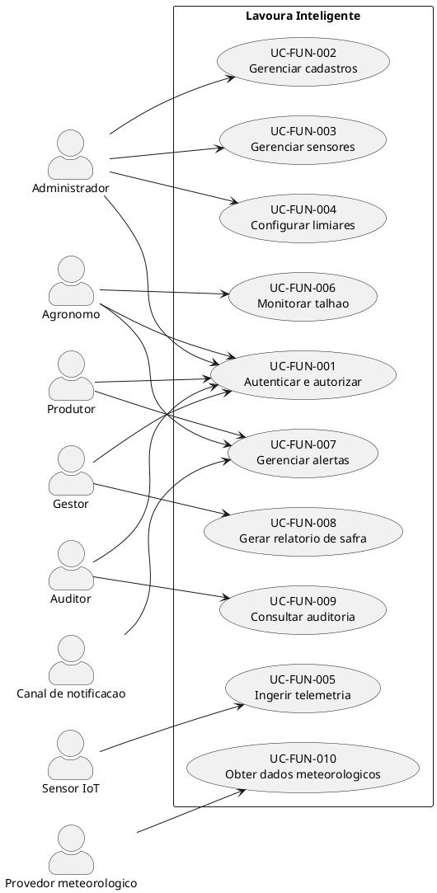

# Casos de Uso (v1.1)

**Projeto**: Lavoura Inteligente 
**Data**: 17/09/2026 
**Status**: Em revisão

## 1. Propósito

Este documento descreve os objetivos observáveis dos usuários e dos sistemas externos.
Atividades de provisionamento AWS foram separadas em cenários arquiteturais, pois são
procedimentos de implantação/operação, e não casos de uso do produto.

## 2. Atores

| Ator | Responsabilidade |
| -- | -- |
| Administrador | Gerenciar usuários, cadastros, sensores e limiares. |
| Agrônomo | Monitorar talhões e tratar alertas. |
| Produtor rural | Receber e consultar alertas de suas fazendas. |
| Gestor agrícola | Consultar indicadores e relatórios de safra. |
| Auditor | Consultar trilhas autorizadas, sem alterá-las. |
| Sensor IoT | Enviar telemetria autenticada. |
| Provedor meteorológico | Fornecer dados complementares. |
| Canal de notificação | Entregar e, quando suportado, confirmar mensagens. |

Serviços AWS são componentes internos da solução e não atores do diagrama.

## 3. Diagrama funcional

Autenticação é uma precondição transversal para os atores humanos; não foi usada
como `include` para evitar confundir controle de acesso com objetivo do usuário.

## 4. Especificação dos casos de uso

### UC-FUN-001 — Autenticar e autorizar usuário

| Elemento | Especificação |
| -- | -- |
| Atores | Administrador, Agrônomo, Produtor, Gestor e Auditor. |
| Precondição | Usuário ativo e cadastrado. |
| Gatilho | Usuário informa suas credenciais. |
| Fluxo principal | 1. Sistema valida credenciais e MFA quando aplicável. 2. Carrega perfil e escopo de fazendas. 3. Inicia sessão e registra o acesso. |
| Alternativas | Credencial inválida: recusar sem revelar o campo incorreto. Conta inativa/bloqueada: negar acesso e registrar evento. Ação fora do escopo: retornar 403. |
| Pós-condição | Sessão autenticada ou tentativa recusada e auditada. |
| Requisitos | RF-IDN-01, RF-IDN-02, RNF-SEG-03, RNF-SEG-06. |

### UC-FUN-002 — Gerenciar cadastros agrícolas e usuários

| Elemento | Especificação |
| -- | -- |
| Ator | Administrador. |
| Precondição | Administrador autenticado e autorizado. |
| Fluxo principal | 1. Seleciona fazenda, talhão, cultura ou usuário. 2. Informa ou altera dados. 3. Sistema valida relações e unicidade. 4. Persiste e audita a mudança. |
| Alternativas | Referência ativa impede exclusão; sistema oferece desativação. Dados inválidos são recusados por campo. |
| Pós-condição | Cadastro consistente e alteração rastreável. |
| Requisitos | RF-IDN-03, RF-ADM-01, RN-07, RNF-SEG-06. |

### UC-FUN-003 — Gerenciar sensores

| Elemento | Especificação |
| -- | -- |
| Ator | Administrador. |
| Precondição | Talhão existente e administrador autorizado. |
| Fluxo principal | 1. Cadastra sensor e tipo de medição. 2. Associa-o ao talhão com vigência. 3. Provisiona identidade individual. 4. Ativa o sensor e registra auditoria. |
| Alternativas | Identidade comprometida: revogar e emitir nova credencial. Transferência: encerrar associação anterior antes da nova. |
| Pós-condição | Sensor possui identidade e associação vigentes. |
| Requisitos | RF-ADM-02, RF-SEN-01, RN-01, RNF-SEG-08. |

### UC-FUN-004 — Configurar limiares agronômicos

| Elemento | Especificação |
| -- | -- |
| Ator | Administrador, com valor aprovado pela área agronômica. |
| Precondição | Cultura/talhão existente. |
| Fluxo principal | 1. Informa métrica, unidade, faixa, severidade, histerese, silêncio e vigência. 2. Sistema valida conflitos. 3. Salva nova versão no RDS. 4. Atualiza a projeção no DynamoDB. 5. Confirma reconciliação e auditoria. |
| Alternativas | Regra conflitante: recusar e apontar a versão vigente. Falha na projeção: manter mudança pendente e alertar operação. |
| Pós-condição | Regra versionada e disponível ao motor de alertas. |
| Requisitos | RF-ADM-03, RF-ADM-04, RN-04, RNF-ALT-04. |

### UC-FUN-005 — Ingerir telemetria

| Elemento | Especificação |
| -- | -- |
| Ator | Sensor IoT. |
| Precondição | Sensor ativo, autenticado e associado a um talhão. |
| Fluxo principal | 1. Sensor envia payload, timestamp e chave de idempotência. 2. Sistema autentica e valida esquema, unidade, faixa e janela temporal. 3. Persiste condicionalmente no DynamoDB. 4. Atualiza projeção de estado. 5. Responde 2xx com correlation ID. |
| Alternativas | Payload inválido: 4xx e nenhuma aceitação. Duplicata: retornar resultado idempotente. Falha de persistência: 5xx para retry seguro. |
| Pós-condição | Leitura aceita está duravelmente persistida e disponível ao Streams. |
| Requisitos | RF-IOT-01 a RF-IOT-05, RN-02, RN-03, RNF-PER-01, RNF-PER-02, RNF-CON-06, RNF-CON-07, RNF-SEG-09. |

### UC-FUN-006 — Monitorar talhão

| Elemento | Especificação |
| -- | -- |
| Ator | Agrônomo. |
| Precondição | Usuário autorizado para a fazenda. |
| Fluxo principal | 1. Seleciona fazenda e talhão. 2. Sistema consulta o estado derivado por talhão. 3. Exibe valor, unidade, sensor, horário, frescor e alertas. 4. Usuário filtra tipo e período para consultar a série paginada. |
| Alternativas | Sem dado recente: sinalizar indisponibilidade/frescor sem apresentar valor antigo como atual. Sem permissão: retornar 403. |
| Pós-condição | Consulta registrada nas métricas, sem alterar dados. |
| Requisitos | RF-MON-01, RF-MON-02, RNF-PER-03, RNF-PER-04, RNF-CAP-03, RNF-USA-01. |

### UC-FUN-007 — Gerenciar alertas

| Elemento | Especificação |
| -- | -- |
| Atores | Agrônomo, Produtor e Canal de notificação. |
| Precondição | Leitura aceita e limiar vigente, ou pendência de limiar identificada. |
| Fluxo principal | 1. Motor avalia leitura e regra versionada. 2. Detecta transição de estado. 3. Cria/atualiza alerta idempotente. 4. Publica no SNS dentro do SLO. 5. Registra estado de entrega disponível. 6. Usuário consulta e pode confirmar ciência. |
| Alternativas | Estado continua crítico: respeitar histerese e silêncio. Sem limiar: abrir pendência operacional. Falha: aplicar retries e destino de falha; replay preserva idempotência. Retorno ao normal: resolver e notificar. |
| Pós-condição | Alerta e suas transições ficam rastreáveis. |
| Requisitos | RF-ALT-01 a RF-ALT-06, RN-04, RN-05, RN-06, RNF-PER-05, RNF-CON-07, RNF-CON-08, RNF-USA-04, RNF-ALT-01 a RNF-ALT-04. |

### UC-FUN-008 — Encerrar e consultar safra

| Elemento | Especificação |
| -- | -- |
| Ator | Gestor agrícola. |
| Precondição | Safra e talhões cadastrados; usuário autorizado. |
| Fluxo principal | 1. Gestor encerra a safra. 2. Sistema valida período e completude. 3. Consolida leituras, alertas e lacunas. 4. Gera relatório versionado. 5. Disponibiliza consulta sem usar Scan na tabela quente. |
| Alternativas | Dados incompletos: gerar com ressalva explícita ou manter pendente conforme decisão do gestor. Falha de consolidação: registrar e permitir retry idempotente. |
| Pós-condição | Safra encerrada e relatório rastreável. |
| Requisitos | RF-SAF-01, RF-SAF-02, RF-ARQ-02, RNF-CON-09, RNF-ARQ-02. |

### UC-FUN-009 — Consultar auditoria

| Elemento | Especificação |
| -- | -- |
| Ator | Auditor. |
| Precondição | Auditor autenticado e autorizado. |
| Fluxo principal | 1. Informa ator, recurso, período ou correlation ID. 2. Sistema consulta eventos imutáveis dentro do escopo. 3. Exibe a linha do tempo e permite exportação autorizada. |
| Alternativas | Consulta ampla: exigir paginação/refino. Evento protegido: ocultar campo sem remover a evidência de sua existência. |
| Pós-condição | Consulta registrada sem alteração da trilha. |
| Requisitos | RF-AUD-01, RNF-SEG-06, RNF-SEG-07, RNF-OPS-03. |

### UC-FUN-010 — Obter dados meteorológicos

| Elemento | Especificação |
| -- | -- |
| Ator | Provedor meteorológico. |
| Precondição | Contrato, credencial e limites configurados. |
| Fluxo principal | 1. Sistema solicita dado por local/período. 2. Valida resposta e unidade. 3. Registra fonte e horário. 4. Atualiza cache. |
| Alternativas | Timeout/limite: usar cache dentro da validade e marcar dado como desatualizado; sem cache, seguir sem complemento e alertar operação. |
| Pós-condição | Dado complementar rastreável ou degradação explícita. |
| Requisitos | RF-MET-01, RN-08, RNF-OPS-07. |

## 5. Cenários arquiteturais

Estes cenários substituem os antigos casos `UC-ARQ-*`. Os procedimentos detalhados
devem ser mantidos em IaC e runbooks versionados.

| ID | Cenário | Resultado verificável | Requisitos relacionados |
| -- | -- | -- | -- |
| CA-ARQ-001 | Provisionar rede Multi-AZ | ALB público; EC2/RDS privados; rotas e NACLs validadas. | RNF-CON-01, RNF-CON-02, RNF-SEG-01, RNF-SEG-04 |
| CA-ARQ-002 | Configurar acesso a serviços | Gateway Endpoints S3/DynamoDB nas route tables e Interface Endpoint para Secrets quando necessário. | RNF-SEG-04, RNF-SEG-05, RNF-CUS-04, RNF-CUS-05 |
| CA-ARQ-003 | Implantar portal | Duas EC2 em AZs distintas, ALB, RDS Multi-AZ e health checks. | RNF-CON-01, RNF-CON-02, RNF-PER-04 |
| CA-ARQ-004 | Implantar ingestão | API Gateway regional, Lambda fora da VPC por padrão e DynamoDB com gravação idempotente. | RNF-PER-01, RNF-PER-02, RNF-CON-06, RNF-CON-07 |
| CA-ARQ-005 | Implantar alertas | Streams, Lambda, SNS, retries, falha parcial, destino durável e replay. | RNF-PER-05, RNF-CON-08, RNF-ALT-01 a 04 |
| CA-ARQ-006 | Implantar consulta e arquivo | Projeção por talhão, consumidor de TTL, S3 e reconciliação. | RNF-CAP-03, RNF-CON-09, RNF-ARQ-01, RNF-ARQ-02 |
| CA-ARQ-007 | Configurar segurança | TLS 1.2+, KMS, MFA, RBAC, IAM, Secrets Manager e auditoria. | RNF-SEG-01 a 09 |
| CA-ARQ-008 | Configurar observabilidade e DR | Dashboards, alarmes, backup, restore e runbooks testados. | RNF-OPS-01 a 06, RNF-CON-03 a 05 |
| CA-ARQ-009 | Configurar CI/CD e custos | Build estrito, testes, aprovação, rollback, Budgets e estimativa reproduzível. | RNF-MAN-01 a 06, RNF-CUS-01 a 05 |

## 6. Matriz de rastreabilidade

| Objetivo da visão | Requisitos funcionais | RNFs principais | Caso/cenário | Evidência planejada |
| -- | -- | -- | -- | -- |
| Acesso controlado | RF-IDN-01 a RF-IDN-03 | RNF-SEG-03, RNF-SEG-06, RNF-SEG-07 | UC-FUN-001, UC-FUN-002; CA-ARQ-007 | Testes de RBAC/MFA e trilha |
| Cadastros e limiares | RF-ADM-01 a 04 | RNF-CON-07, RNF-ALT-04 | UC-FUN-002/004 | Testes de validação, versão e reconciliação |
| Sensores confiáveis | RF-SEN-01, RF-IOT-01 a RF-IOT-05 | RNF-PER-01, RNF-PER-02, RNF-CON-06, RNF-CON-07, RNF-SEG-08, RNF-SEG-09 | UC-FUN-003, UC-FUN-005; CA-ARQ-004 | Carga, falha, retry e idempotência |
| Painel por talhão | RF-MON-01, RF-MON-02 | RNF-PER-03, RNF-PER-04, RNF-CAP-03, RNF-USA-01 | UC-FUN-006; CA-ARQ-006 | Plano de consulta e teste p95 |
| Alertas | RF-ALT-01 a 06 | RNF-PER-05, RNF-CON-08, RNF-USA-04, RNF-ALT-01 a 04 | UC-FUN-007; CA-ARQ-005 | Latência, deduplicação, estado, falha e replay |
| Safras e arquivo | RF-SAF-01, RF-SAF-02, RF-ARQ-01 a RF-ARQ-03 | RNF-CON-09, RNF-ARQ-01, RNF-ARQ-02 | UC-FUN-008; CA-ARQ-006 | Relatório, TTL, reconciliação e restore |
| Meteorologia | RF-MET-01 | RNF-OPS-07 | UC-FUN-010 | Timeout, cache e contingência |
| Auditoria/LGPD | RF-AUD-01 | RNF-SEG-06/07, RNF-OPS-03 | UC-FUN-009; CA-ARQ-007 | Consulta imutável e inventário de dados |
| Continuidade | — | RNF-CON-01 a 05, RNF-OPS-04/05/06 | CA-ARQ-001/003/008 | Sondas, falha de AZ, backup e restore |
| Entrega e custo | — | RNF-MAN-01 a 06, RNF-CUS-01 a 05 | CA-ARQ-009 | Pipeline, rollback, Calculator e Budgets |

## 7. Histórico e aprovação

| Versão | Data | Status | Descrição | Autor(es) |
| -- | -- | -- | -- | -- |
| 1.0 | 08/09/2026 | Substituída | Oito casos de provisionamento arquitetural. | Joao Vitor Donda, Caique Rechuan e Joao Gabriel Meirelles |
| 1.1 | 17/09/2026 | Em revisão | Casos funcionais, cenários arquiteturais e rastreabilidade por IDs. | Equipe do projeto |

| Papel aprovador | Nome | Data | Decisão |
| -- | -- | -- | -- |
| Representante agronômico | | | Pendente |
| Arquiteto de Soluções | | | Pendente |
| Professor responsável | | | Pendente |
